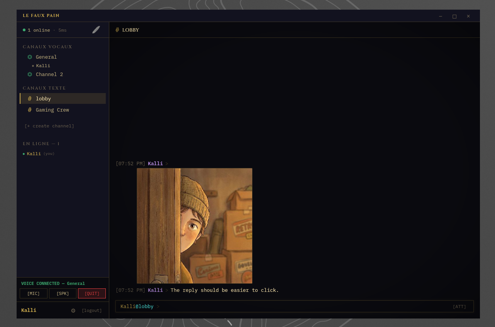

# Le Faux Pain

Self-hostable voice and text chat — like Discord, but yours. One Go binary, one SQLite database, no external services required.

Text channels with replies, reactions, mentions, and image uploads. Voice channels powered by a built-in WebRTC SFU (Pion). Works in any browser. Optional native desktop client via Tauri.

<a href="docs/screenshot02.png"></a>

## Quick Start (Self-Hosting)

### Prerequisites

- [Go 1.24+](https://go.dev/dl/)
- [Node.js 18+](https://nodejs.org/) with npm

### Build

```bash
git clone https://github.com/zsazsa/lefauxpain.git
cd lefauxpain

# 1. Build the frontend
cd client && npm install && npm run build && cd ..

# 2. Copy frontend into the server embed directory
rm -rf server/static/assets/* server/static/index.html
cp -r client/dist/* server/static/

# 3. Build the server
cd server && go build -o voicechat . && cd ..
```

### Run

```bash
./server/voicechat --port 8080
```

Open `http://localhost:8080` in your browser. That's it — register a username and start chatting.

Data (database, uploads, avatars) is stored in `./data/` by default.

### Server Flags

| Flag | Env Var | Default | Description |
|------|---------|---------|-------------|
| `--port` | `PORT` | `8080` | HTTP server port |
| `--data-dir` | `DATA_DIR` | `./data` | Where database and uploads are stored |
| `--public-ip` | `PUBLIC_IP` | *(empty)* | Your server's public IP (required for voice chat over the internet) |
| `--stun-server` | `STUN_SERVER` | `stun:stun.l.google.com:19302` | STUN server for WebRTC NAT traversal |
| `--max-upload-size` | `MAX_UPLOAD_SIZE` | `10485760` (10 MB) | Maximum file upload size in bytes |
| `--dev` | — | `false` | Dev mode (proxies frontend requests to Vite on :5173) |

### Production Example

For a server with a public IP at `203.0.113.50`:

```bash
./voicechat --port 8080 --public-ip 203.0.113.50 --data-dir /opt/lefauxpain/data
```

Voice chat requires `--public-ip` to be set to your server's public IP so WebRTC can establish peer connections through NAT.

For HTTPS, put a reverse proxy (nginx, Caddy, etc.) in front. See `docs/deploy.md` for a full nginx + systemd + Let's Encrypt example.

## Connecting to Your Server

### From a Browser

Just open `https://your-domain.com` (or `http://your-ip:8080` without a reverse proxy). Works on desktop and mobile browsers.

### From the Desktop Client

The desktop client is a lightweight native window (Tauri/WebView) that connects to any Le Faux Pain server.

Download a prebuilt release from [GitHub Releases](https://github.com/zsazsa/lefauxpain/releases):

| Platform | Download |
|----------|----------|
| Windows | [LeFauxPain_x64-setup.exe](https://github.com/zsazsa/lefauxpain/releases/latest/download/LeFauxPain_1.1.0_x64-setup.exe) or [.msi](https://github.com/zsazsa/lefauxpain/releases/latest/download/LeFauxPain_1.1.0_x64_en-US.msi) |
| macOS (Apple Silicon) | [LeFauxPain_aarch64.dmg](https://github.com/zsazsa/lefauxpain/releases/latest/download/LeFauxPain_1.1.0_aarch64.dmg) |
| macOS (Intel) | [LeFauxPain_x64.dmg](https://github.com/zsazsa/lefauxpain/releases/latest/download/LeFauxPain_1.1.0_x64.dmg) |
| Linux (Debian/Ubuntu) | [LeFauxPain_amd64.deb](https://github.com/zsazsa/lefauxpain/releases/latest/download/LeFauxPain_1.1.0_amd64.deb) |
| Linux (AppImage) | [LeFauxPain_amd64.AppImage](https://github.com/zsazsa/lefauxpain/releases/latest/download/LeFauxPain_1.1.0_amd64.AppImage) |
| Linux (RPM) | [LeFauxPain_x86_64.rpm](https://github.com/zsazsa/lefauxpain/releases/latest/download/LeFauxPain-1.1.0-1.x86_64.rpm) |

On first launch, you'll see a connect screen where you enter your server URL (e.g. `https://your-domain.com`). The app remembers your choice for next time.

### Build the Desktop Client Yourself

Requires [Node.js 18+](https://nodejs.org/) and [Rust](https://rustup.rs/).

Linux also needs: `libwebkit2gtk-4.1-dev libappindicator3-dev librsvg2-dev patchelf`

```bash
cd desktop
npm install
npx tauri build
```

Installers will be in `desktop/src-tauri/target/release/bundle/`.

## Development

Run the frontend and backend in separate terminals:

```bash
# Terminal 1 — frontend with hot reload
cd client && npm install && npm run dev

# Terminal 2 — Go server proxying to Vite
cd server && go run . --dev --port 8080
```

The frontend runs on `:5173` with HMR. The Go server on `:8080` proxies frontend requests to Vite in dev mode.

## Architecture

```
┌─────────────┐       ┌──────────────────────────────┐
│   Browser   │◄─────►│         Go Server             │
│  or Tauri   │  WS   │  ┌────────┐  ┌───────────┐   │
│  Desktop    │  +    │  │ WS Hub │  │ Pion SFU  │   │
│  Client     │  HTTP  │  └────┬───┘  └─────┬─────┘   │
└─────────────┘       │       │             │         │
                      │  ┌────▼─────────────▼────┐    │
                      │  │    SQLite (WAL mode)   │    │
                      │  └────────────────────────┘    │
                      └──────────────────────────────┘
```

- **Backend** (`server/`): Go, SQLite, WebSocket hub, Pion WebRTC SFU
- **Frontend** (`client/`): SolidJS + TypeScript + Vite
- **Desktop** (`desktop/`): Tauri v2 thin client (native webview window)

Single WebSocket connection per user. All real-time events (messages, voice state, presence) go through the WebSocket. File uploads go through REST, then get linked to messages via WebSocket.

## License

MIT
